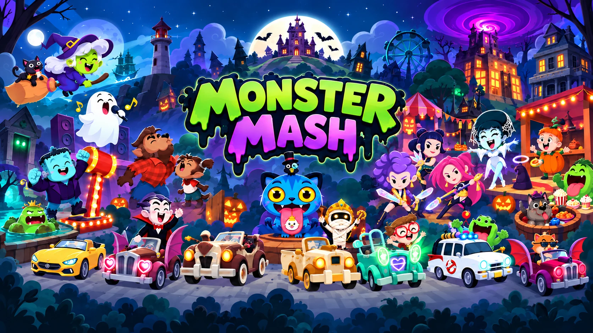

<p align="center">
  
</p>

<h1 align="center">Monster Mash Trade Hub</h1>

<p align="center">
  A fan-made sticker tracker for the Monopoly GO <b>Monster Mash</b> album (Demon Hunters collab).<br>
  Multi-account album · trade planner · Star Vault · event planner · Trick or Treat · installable web app.
</p>

---

## Play with it

- **Online:** once GitHub Pages is on (see below), the app lives at `https://<your-user>.github.io/<repo-name>/`.
- **Offline / local:** download the repo and open `index.html`, or serve the folder:

  ```bash
  python -m http.server 8000
  ```

  then visit `http://localhost:8000`. (Serving it enables the offline service worker and "Install app".)

Everything you enter stays in your browser. Use **Import / Export → Full backup (.json)** to move to another device.

## What's inside

| | |
|---|---|
| **Album** | 22 sets · 198 stickers, every account side by side in synced swipeable lanes |
| **Trade Planner** | who needs what, who has spares, one-tap send lists |
| **Event Planner** | Community Chest, Racers, Partner Build and Adventure Club perspectives |
| **Star Vault & Progress** | vault stars from spares, milestones, leaderboards |
| **Collection** | 53 favicon / app-icon rewards unlocked by completing sets |
| **Import / Export** | CSV account lists, friend lists and sticker exports with preview + undo |

## Juice ✨

The app runs on a "juice" layer (`assets/mm-juice.js` + `assets/mm-juice.css`) that adds motion, sound and feel on top of the tracker without changing how it works:

- **Page transitions** that slide in the direction you navigate, with a springy liquid indicator on the mobile tab bar
- **Ripples, jelly presses and soft click sounds** on every button; hover ticks on desktop
- **Sticker combos:** tap stickers quickly for `x2 … x10 COMBO` popups with rising notes, and confetti every 5
- **Canvas confetti cannons** on set and album completions, fireworks for a full album
- **Fireflies** drifting behind the page, and a **lantern glow** that follows your mouse
- **Circular theme reveal** from wherever you tap (View Transitions API)
- **Haptics** on phones (Android): sticker taps, trades, unlocks, jump scares
- **Swipe-down to close** bottom sheets, scroll-reveal cards, a scroll progress bar, flip-clock countdown
- **Keyboard shortcuts** on PC: `1`–`9` pages, `[` `]` prev/next, `/` search, `T` theme, `M` mute, `J` juice level, `?` help
- A secret. Old-school gamers will know the code. (On phones, tap the countdown seven times.)

**Juice levels:** `MAX` (everything) · `LITE` (no fireflies/lantern, lighter on battery) · `OFF`. Switch from the side menu, the **More** sheet, or press `J`. Low-power devices start on LITE, and *reduce motion* is always respected.

## Performance notes

- The album grid, trade lists and planners use **360×480 thumbnails** (`assets/stickers-thumbs/`, ~5.5 MB total instead of ~50 MB). Zoom views, share images and exports still use the full-resolution art.
- Grid images are **lazy-loaded** and decoded off the main thread; off-screen album sets skip rendering (`content-visibility`).
- The service worker precaches only the small app shell. Artwork is cached the first time it's seen, and thumbnails warm up in the background on good connections.

Regenerate thumbnails after changing sticker art:

```bash
pip install pillow
python tools/make_thumbs.py
```

## Publish on GitHub Pages

1. Push this folder to a GitHub repo (branch `main`).
2. **Settings → Pages → Build and deployment → Source: GitHub Actions**.
3. The included workflow (`.github/workflows/pages.yml`) deploys on every push to `main`.

Bump `VERSION` in `service-worker.js` when you ship changes so installed copies pick them up promptly.

## Project layout

```
index.html              the app (styles, markup and engine)
assets/mm-juice.*       animation / sound / feel layer
assets/mm-*.js          artwork maps (key → file path)
assets/stickers/        full-resolution sticker art
assets/stickers-thumbs/ grid-size sticker art (generated)
assets/…                tokens, favicons, events, trick-or-treat, UI art, PWA icons
samples/                example CSVs for trying imports
service-worker.js       offline support
tools/make_thumbs.py    thumbnail builder
docs/                   update notes, audits and the original readme
```

## Disclaimer

Fan project. Monopoly GO!, Hasbro, Scopely, KPop Demon Hunters, Ghostbusters and all related names, characters, images and trademarks belong to their respective owners. This site is unofficial and is not affiliated with, endorsed by, or sponsored by any of them.
